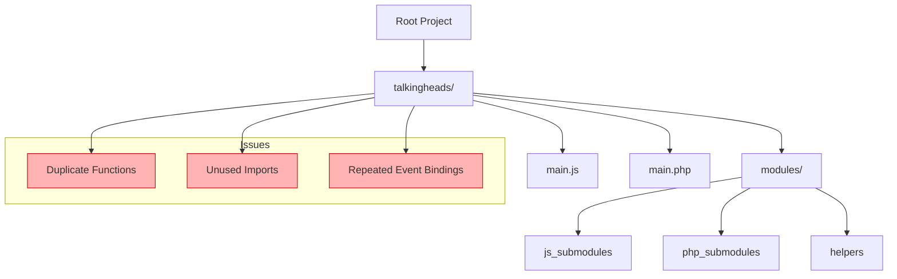
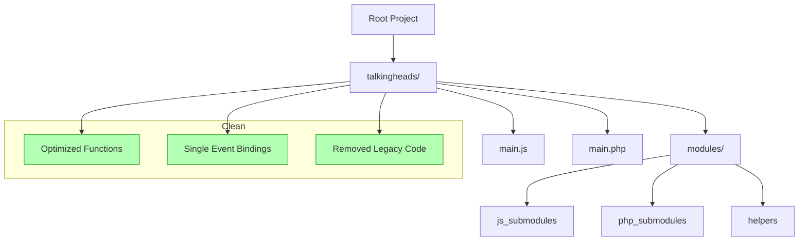

# Cursor AI Project Cleanup and Refactor Prompt

## Overview
This prompt is designed for **Cursor AI** to analyze and refactor your `talkingheads` project. It uses **Codebase Analyst** to detect duplicate or unused code and **Taskmaster** to safely clean it up while preserving full functionality.

---

## 🧩 Project Structure
```
root/
│
├── talkingheads/
│   ├── main.js
│   ├── main.php
│   └── modules/
│       ├── js_submodules/
│       ├── php_submodules/
│       └── helpers/
│
└── (root files – do not modify)
```

---

## 🧠 Cursor AI Prompt: Code Analysis + Refactor Plan

````markdown
#agent: Codebase Analyst
#mode: Audit

Analyze the `talkingheads/` folder and its subfolder `talkingheads/modules/`.  
Do not analyze or modify files in the root directory.

### Objectives
1. Identify and list all **duplicate functions** (both JS and PHP).
2. Detect **unused code**, variables, includes, or imports.
3. Locate **redundant event bindings or repeated logic** causing multiple executions.
4. Find **outdated or legacy code** that isn’t used in the current version.

### Output
- Detailed report listing file paths and line numbers for duplicates or unused code.
- Functions or modules that can safely be merged or removed.
- Dependencies that require verification before deletion.
- Summary of overall code health (duplication %, unused code count, etc.).

---

#agent: Taskmaster
#mode: Refactor

Based on the analysis report, create a **refactor plan** to safely remove or merge unused and duplicate code within:
- `talkingheads/`
- `talkingheads/modules/`

### Requirements
- Preserve all functionality.
- Only remove or merge confirmed redundant code.
- Clean redundant includes, imports, and bindings.
- Ensure no multiple executions of functions.
- Conform to **Taskmaster formatting rules**.
- Do **not edit or create files** in the root directory.

### Deliverables
1. A detailed **refactor plan** listing:
   - Files to update
   - Functions to merge or delete
   - Dependencies to test after refactor
2. A **final summary** confirming:
   - No functionality was lost
   - No required functions removed
   - All code follows current standards
````

---

## 🧭 Mermaid Diagrams

### 🕸️ Before Refactor


### ✅ After Refactor


---

## 🧰 Usage Instructions
1. Open the project in **Cursor AI**.
2. Focus on the `talkingheads/` folder (not root).
3. Paste this full prompt into Cursor.
4. Run **Codebase Analyst** first to audit the project.
5. Then use **Taskmaster** to execute the refactor plan.
6. Review the summary and test your project.

---

## ✅ Expected Outcome
- Clean, optimized, and maintainable code.
- No duplicates or unused logic.
- No repeated event bindings.
- Full functionality preserved.
